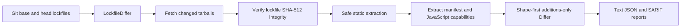

# capdelta

**Review what an npm dependency gained between two lockfiles.**

Traditional vulnerability scanners answer “is this version already known to
be vulnerable?” capdelta asks a different question: **what can the new version
do that the old version could not?** A newly added install script, command
entrypoint, dependency, or runtime constraint is review-worthy even before a
CVE exists.

> **Development status:** private, unpublished, and at the M3 AST-analysis
> milestone. It is suitable for development and evaluation, not production
> enforcement; corpus-calibrated false-positive measurements follow M3.

## What M3 detects

For every direct and transitive npm package whose resolved version changed,
capdelta compares `package.json` behavior and reports additions or changes to:

- `preinstall`, `install`, `postinstall`, and `prepare` scripts;
- command entrypoints from `bin`;
- dependencies; and
- runtime constraints from `engines`.

New packages receive a full manifest capability report. Removed packages are
ignored. The current implementation accepts one npm `package-lock.json` v2 or
v3 in the current working directory of a Git checkout.

The static AST layer also reports gained `PROCESS`, `NET`, `FS_READ`,
`FS_WRITE`, `FS_SENSITIVE`, `ENV`, `DYNAMIC_CODE`, `NATIVE`, and `UNKNOWN`
capabilities. Literal imports and one immutable alias hop are resolved;
anything deeper is reported honestly as `UNKNOWN`. Literal install-script
entry files retain their install-time context.

## Try it locally

Requirements: Node.js 20 or newer, npm, and Git.

Run capdelta from the directory containing the lockfile to compare.

```bash
npm ci
npm run build
node dist/cli.js --base main
```

Select machine-readable output with:

```bash
node dist/cli.js --base main --format json
```

The intended published interface is:

```bash
npx capdelta --base main
```

The npm package is not published while the repository remains private, so use
the built entrypoint during development.

### GitHub Action

Pin the Action to a full commit SHA rather than a mutable tag:

```yaml
name: capdelta
on:
  pull_request:
    paths: [package-lock.json]

permissions:
  contents: read
  pull-requests: write
  security-events: write

jobs:
  review:
    runs-on: ubuntu-latest
    steps:
      - uses: actions/checkout@9c091bb21b7c1c1d1991bb908d89e4e9dddfe3e0 # v7.0.0
        with:
          ref: ${{ github.event.pull_request.head.sha }}
          persist-credentials: false
      - uses: Volkiaa/capdelta@89f87e0007b128496c5818005c884c1ac2f3ea74
        with:
          github-token: ${{ github.token }}
          fail-on: CRITICAL
```

`fail-on` accepts `CRITICAL`, `HIGH`, `MEDIUM`, `LOW`, `INFO`, or `none` and
defaults to `CRITICAL`. The Action updates one size-capped summary comment and
uploads the complete `capdelta-report` JSON artifact. If the base lockfile is
absent, it uses aggregate first-run mode. Fork and Dependabot PRs have
read-only credentials, so capdelta writes the same inert summary to the job
summary and relies on the job conclusion for check status instead of trying to
post a comment.

If dependency PRs can auto-merge, make the capdelta job a required status
check so a bump cannot merge before the configured gate runs.

### CLI behavior

```text
Usage: capdelta --base <ref> [--format text|json]
```

- If `package-lock.json` did not change relative to the base commit, capdelta
  exits `0` with no output and performs no analysis.
- Text is the default format. JSON contains full structured detail.
- A newly added lockfile enters first-run mode: text stays aggregate-only while
  JSON retains every package report.
- Expected package-local failures are reported instead of disappearing.
- Exit `0` means the CLI analysis completed, even when findings were reported.
  Exit `1` means an operational failure; exit `64` means invalid CLI usage.
  Exit `2` remains reserved for future `--strict` incomplete-analysis results
  per PLAN §4.5. The Action applies the `fail-on` threshold after preserving
  its comment or job summary and JSON artifact.

Example text finding:

```text
capdelta manifest analysis report
Mode: comparison
Packages: 1 changed; 1 analyzed; 0 unavailable; 0 lockfile skips.
Signals: 1 manifest finding (CRITICAL: 1); 0 lockfile findings; 0 analysis issues; 0 manifest diagnostics.

Findings:
- [CRITICAL] "postinstall" registry install hook added
  Evidence: "package.json":5 — "\"postinstall\": \"echo test\""
```

All evidence includes `file:line` and an escaped, length-bounded snippet.
Report wording asks reviewers to inspect a change; it does not claim malware
was detected.

## How it works



The no-op check happens before lockfile parsing or network access. Changed
packages are fetched with bounded concurrency, verified against their lockfile
SRI before parsing, extracted under resource limits, and analyzed without
executing package code. Package-local failures remain visible in the final
summary (“degrade loudly”).

The npm-specific lockfile and manifest implementations sit behind core
contracts so future ecosystems can add adapters without rewriting the Differ
or Reporter.

## Security model

### Adversary

capdelta assumes an attacker can publish a new version of a legitimate npm
package through account takeover, a malicious maintainer, or a compromised
release pipeline. Lockfiles, manifests, tarballs, package names, URLs, and
report snippets are treated as attacker-controlled input.

### Safety controls present through M3

- package code is never imported, evaluated, or executed—not even in tests;
- tarballs are verified against lockfile SHA-512 integrity before parsing;
- extraction rejects absolute paths, traversal, links, unsupported entries,
  invalid npm archive layouts, and resource-limit violations;
- defaults cap tarballs at 50 MiB, extracted entries at 10,000, expanded data
  at 250 MiB, and decompression ratio at 100:1;
- fetching defaults to eight concurrent downloads with a 30-second per-request
  timeout; extraction defaults to four packages concurrently;
- head lockfile symlinks are rejected and lockfile reads are capped at 50 MiB;
- Git is invoked with argument arrays, never through a shell;
- report and terminal strings are escaped and truncated; and
- malformed or unavailable data is reported rather than silently skipped.

Private registries are not authenticated in M1. Non-`registry.npmjs.org`
packages are skipped and flagged.

### Known limitations and evasions

- **No-delta attacks:** behavior that was already present in the baseline is
  not newly reported.
- **Slow-roll attacks:** capabilities can be introduced across several
  apparently modest releases. A committed reviewed baseline is planned later.
- **Bounded resolution:** M3 resolves literal imports and one `const` alias hop,
  but not re-exports or general JavaScript dataflow. Deeper uses become
  `UNKNOWN` rather than guessed.
- **Source coverage:** `.ts` is diagnosed as unsupported in v0.1. The signal
  layer for obfuscation, entropy, and URL-domain changes arrives in M4.
- **Script semantics:** install hooks are never executed. Only conservative
  literal `node path.js` entrypoints receive install-code attribution.
- **Registry scope:** private registries, mirrors, git, file, and link
  dependencies are skipped and surfaced as unanalyzed.
- **Single ecosystem and lockfile:** npm v2/v3 only, with one
  current-directory `package-lock.json` per invocation.

These are product limits, not claims that the corresponding attacks are safe.
Please report silent bypasses or unsafe parsing privately through
[SECURITY.md](SECURITY.md).

## Permissions and network access

The CLI needs:

- read access to the checkout, `.git`, and current-directory
  `package-lock.json`;
- temporary-directory write access for bounded extraction; and
- outbound HTTPS access to `registry.npmjs.org`.

It does not need a GitHub token. The Action workflow requests exactly:

```yaml
permissions:
  contents: read
  pull-requests: write
  security-events: write
```

`contents: read` retrieves the base lockfile at the immutable PR base commit;
`pull-requests: write` maintains the sticky comment. The metadata file cannot
declare permissions—GitHub permissions belong to the calling workflow.
`security-events: write` uploads the M3 SARIF report to code scanning. Fork and
Dependabot PRs cannot use that write permission, so capdelta degrades loudly to
the JSON artifact, job summary, and check conclusion.

Never work around fork-PR permissions with `pull_request_target` while checking
out untrusted PR code.

## Development

```bash
npm run format:check
npm run lint
npm run typecheck
npm test
npm run check:deps
npm run check:action
```

Tests use inert handcrafted lockfiles and tarballs. The golden M1 pair changes
from a benign manifest to `"postinstall": "echo test"`; package code is never
run. CI executes the suite on Node.js 20 and 22.

The runtime dependency budget is fewer than 10 direct dependencies. M2 uses
five: `tar`, `jsonc-parser`, and the official `@actions/core`,
`@actions/github`, and `@actions/artifact` packages. Repository CI enforces the
direct-dependency budget and verifies that the committed Action bundle is
current.

No true-positive/false-positive corpus measurements have been published yet.
The golden fixture verifies end-to-end behavior, not detection accuracy.
Measured and labeled validation is planned before public release.

## Architecture decisions

- [ADR-001: TypeScript](docs/adr/0001-typescript.md)
- [ADR-002: Static-only analysis](docs/adr/0002-static-only-analysis.md)
- [ADR-003: Analyze all changed packages](docs/adr/0003-transitive-all-packages.md)
- [ADR-004: Ecosystem interface boundary](docs/adr/0004-ecosystem-interface-boundary.md)
- [ADR-005: Shape-based severity](docs/adr/0005-shape-based-severity-from-capdiff.md)
- [ADR-006: Preserve old resolved URLs](docs/adr/0006-changedpackage-carries-old-resolved-url.md)
- [ADR-007: Moved-package matching](docs/adr/0007-moved-package-matching-rule.md)
- [ADR-008: Differ emits facts](docs/adr/0008-differ-emits-facts-not-severities.md)
- [ADR-009: Non-npmjs hosts are private](docs/adr/0009-non-npmjs-host-is-private.md)
- [ADR-010: Preflight extraction and reject links](docs/adr/0010-preflight-and-reject-links-in-npm-tarballs.md)
- [ADR-011: Bound extraction resources](docs/adr/0011-bound-npm-tarball-extraction-resources.md)

The authoritative architecture and roadmap are in [docs/PLAN.md](docs/PLAN.md).

## Roadmap

- **M2:** GitHub Action, sticky summary, exit-code policy, adversarial report
  rendering tests, and dogfooding.
- **M3:** JavaScript AST capability analysis and SARIF.
- **M4:** lexical/entropy signals, allowlists, wall-clock budgeting, and fuzzing.
- **M5:** measured validation, publication evidence, and public release work.

## License

Apache-2.0. See [LICENSE](LICENSE).
