# capdelta

**Review what an npm dependency gained between two lockfiles.**

Traditional vulnerability scanners ask whether a version is already known to be
vulnerable. capdelta asks a different question: **what can the new version do
that the old version could not?** A newly added install script, process launch,
network client, secret-file read, or dynamic-code primitive is review-worthy
before a CVE exists.

> **Development status:** the repository is public, but the npm package is
> marked private, unpublished, and versioned `0.0.0`. M0-M3 are implemented;
> the project is at the required post-M3 false-positive corpus checkpoint before
> the remaining M4 signal work. It is suitable for development and evaluation,
> not production enforcement. No measured detection or false-positive claims
> have been published.

## What capdelta detects today

capdelta analyzes every direct and transitive npm package whose resolved
lockfile artifact changed. Removed packages are ignored. A newly added package
has no baseline, so its complete capability set is reported.

The manifest layer detects additions or behavior changes to:

- `preinstall`, `install`, and `postinstall` registry install hooks;
- `prepare` hooks, labeled as git-only;
- command entrypoints from `bin`;
- dependencies, including npm aliases; and
- runtime constraints from `engines`.

The static JavaScript layer parses `.js`, `.mjs`, and `.cjs` and detects:

- `PROCESS` — child processes and command execution;
- `NET` — HTTP, HTTPS, sockets, `fetch`, and WebSocket access;
- `FS_READ` and `FS_WRITE`;
- `FS_SENSITIVE` — literal paths near stores such as `.npmrc`, `.env`,
  `.ssh/`, AWS credentials, and GitHub CLI configuration;
- `ENV` — `process.env`;
- `DYNAMIC_CODE` — `eval`, `Function`, and `vm`;
- `NATIVE` — native addons, node-gyp, and WebAssembly loading; and
- `UNKNOWN` — dynamic imports or calls that the bounded resolver cannot
  identify honestly.

Resolution covers literal ESM/CommonJS imports and one immutable `const` alias
hop. Anything deeper becomes `UNKNOWN`; capdelta does not pretend to perform
general JavaScript dataflow. Literal files invoked by install hooks retain
install-time location context.

Lockfile-level facts are also surfaced: same-version integrity changes,
downgrades, unanalyzable git/file/link sources, private registries, malformed
entries, and first-run lockfile additions.

## Severity means review priority

capdelta reports capability gains, not a malware verdict. Shape rules can
promote otherwise ordinary capabilities when their combination or location is
more dangerous.

| Priority     | Current examples                                                                                                                                                                  |
| ------------ | --------------------------------------------------------------------------------------------------------------------------------------------------------------------------------- |
| **CRITICAL** | Registry install hook added/changed; `NET`, `PROCESS`, `ENV`, or `FS_SENSITIVE` in install code; `NET` plus secret access; `DYNAMIC_CODE` or `NATIVE`; tarball integrity mismatch |
| **HIGH**     | `NET`, `PROCESS`, or `FS_SENSITIVE` gain; integrity changed while version stayed the same                                                                                         |
| **MEDIUM**   | `ENV` or `FS_WRITE` gain                                                                                                                                                          |
| **LOW**      | `FS_READ`, `UNKNOWN`, command entrypoint, or dependency gain                                                                                                                      |
| **INFO**     | Runtime-constraint change, git-only hook, downgrade, or other review context                                                                                                      |

Within each package, findings are ordered from CRITICAL through INFO in JSON and
text. The size-capped PR table prioritizes findings globally before selecting
its detail rows. Every capability finding includes escaped, length-bounded
`file:line` evidence and a snippet. Copy says “review this change,” never
“malware detected.”

## Try the CLI

Requirements: Node.js 20 or newer, npm, and Git.

From the directory containing one `package-lock.json`:

```bash
npm ci
npm run build
node dist/cli.js --base main
```

Machine-readable output:

```bash
node dist/cli.js --base main --format json
```

The intended published interface is:

```bash
npx capdelta --base main
```

The npm package is still marked private and has not been published, so use the
built entrypoint during development.

### CLI behavior

```text
Usage: capdelta --base <ref> [--format text|json]
```

- The base ref is resolved to an immutable commit. Git is invoked with argument
  arrays and no shell; the validated base blob is read by object ID.
- If `package-lock.json` is unchanged, capdelta exits `0` with no output and
  performs no lockfile parsing, extraction, or network access.
- An untracked, newly added lockfile enters first-run mode. Text stays
  aggregate-only; JSON retains every package report.
- Expected package-local failures and partial-analysis diagnostics remain in
  the report instead of disappearing.
- Exit `0` means analysis completed, even if findings need review. Exit `1`
  means an operational failure. Exit `64` means invalid usage.
- Exit `2` remains reserved for the planned `--strict` incomplete-analysis
  mode (PLAN §4.5).

Example excerpt:

```text
capdelta capability analysis report
Mode: comparison
Packages: 1 changed; 1 analyzed; 0 unavailable; 0 lockfile skips.
Signals: 1 capability finding (CRITICAL: 1); 0 lockfile findings; 0 analysis issues; 0 analysis diagnostics.

Findings:
- [CRITICAL] "postinstall" registry install hook added
  Evidence: "package.json":5 — "\"postinstall\": \"echo test\""
```

## Use the GitHub Action

Pin the Action to a reviewed full commit SHA rather than a mutable branch or
tag:

```yaml
name: capdelta

on:
  pull_request:
    paths:
      - package-lock.json

permissions:
  contents: read
  pull-requests: write
  security-events: write

jobs:
  review:
    runs-on: ubuntu-latest
    steps:
      - uses: actions/checkout@9c091bb21b7c1c1d1991bb908d89e4e9dddfe3e0 # v7.0.0
        with:
          ref: ${{ github.event.pull_request.head.sha }}
          persist-credentials: false
      - uses: Volkiaa/capdelta@89f87e0007b128496c5818005c884c1ac2f3ea74
        with:
          github-token: ${{ github.token }}
          fail-on: CRITICAL
```

The example pin is the repository's currently dogfooded immutable Action
revision. Review and update pins deliberately when adopting a newer revision.

### Action inputs

| Input           | Default               | Behavior                                                                    |
| --------------- | --------------------- | --------------------------------------------------------------------------- |
| `github-token`  | `${{ github.token }}` | Reads base contents, comments, and uploads reports                          |
| `lockfile-path` | `package-lock.json`   | One repository-relative npm lockfile                                        |
| `fail-on`       | `CRITICAL`            | Inclusive threshold: `CRITICAL`, `HIGH`, `MEDIUM`, `LOW`, `INFO`, or `none` |
| `base-ref`      | PR base SHA           | Optional base Git ref override                                              |
| `config-path`   | empty                 | Reserved; non-empty values fail loudly until M4 allowlists exist            |

Outputs are `status` (`no-op`, `passed`, or `failed`), `artifact-id`,
and `highest-severity`.

The Action:

1. takes the no-op path when the configured lockfile did not change;
2. retrieves the base lockfile through the GitHub Contents API at an immutable
   base commit;
3. uploads the complete schema-v3 JSON report as the `capdelta-report`
   artifact;
4. uploads SARIF 2.1.0 to code scanning when permissions permit;
5. creates or updates one 60,000-character-capped sticky summary comment; and
6. applies `fail-on` only after report delivery.

Fork and Dependabot PRs have read-only credentials. capdelta therefore writes
the same inert summary to the job summary, retains the JSON artifact, relies on
the job conclusion for status, and skips SARIF/comment writes it cannot perform.
Never work around this with `pull_request_target` while checking out untrusted
PR-head code.

If dependency updates can auto-merge, make the capdelta job a required status
check so a bump cannot merge before the configured gate runs.

## How it works

```mermaid
flowchart LR
    A["Base and head package-lock.json"] --> B["npm LockfileDiffer"]
    B --> C["Fetch changed tarballs"]
    C --> D["Verify lockfile SHA-512 integrity"]
    D --> E["Safe static extraction"]
    E --> F["Manifest + JavaScript capability extraction"]
    F --> G["Ecosystem-agnostic capability sets"]
    G --> H["Shape-first additions-only Differ"]
    H --> I["Text + JSON + PR summary + SARIF"]
```



The no-op check precedes parsing and network access. Changed tarballs are
verified byte-for-byte against lockfile SRI before extraction. Package code is
never imported or executed. The npm-specific lockfile and extractor
implementations sit behind core contracts so another ecosystem can add adapters
without rewriting the Differ or Reporter.

### Default resource limits

| Boundary                      | Default                                                                   |
| ----------------------------- | ------------------------------------------------------------------------- |
| Whole capability-analysis run | 5-minute deadline                                                         |
| Fetching                      | 8 concurrent requests, 30-second request timeout, 50 MiB per tarball      |
| Extraction                    | 4 concurrent packages, 10,000 entries, 250 MiB expanded data, 100:1 ratio |
| Manifest                      | 1 MiB                                                                     |
| JavaScript source             | 2 MiB per file, 5-second parser-worker deadline                           |
| CLI lockfile                  | 50 MiB                                                                    |
| CLI Git command               | 60 seconds, then soft-to-hard termination escalation                      |
| PR comment                    | 60,000 characters, 10 prioritized detail rows by default                  |

Deadline, cancellation, cleanup, parser-worker termination, and package-local
failures all degrade loudly into structured report issues. Limits are exposed
through the analysis-library options; the current CLI exposes only report
format and base ref.

## Security model

### Adversary

capdelta assumes an attacker can publish a new version of a legitimate npm
package through account takeover, a malicious maintainer, or a compromised
release pipeline. Lockfiles, manifests, tarballs, package names, URLs, report
snippets, and JavaScript source are attacker-controlled input.

### Safety controls

- package code is never imported, evaluated, or executed—not even in tests;
- tarballs are verified against lockfile SHA-512 integrity before parsing;
- extraction rejects absolute paths, traversal, links, unsupported entries,
  invalid npm layouts, and resource-limit violations;
- parsing runs statically under source-size and worker deadlines;
- lockfile symlinks are rejected and reads are capped;
- Git and child processes are shell-free, time-bounded, and forcibly detached
  if termination cannot be confirmed;
- report, terminal, Markdown, JSON, and SARIF strings are escaped or serialized
  and truncated; and
- malformed or unavailable data remains visible.

Private registries and mirrors are not authenticated in v0.1. Any host other
than `registry.npmjs.org` is skipped and flagged.

### Known limitations and evasions

- **No-delta attacks:** behavior already present in the baseline is not newly
  reported.
- **Slow-roll attacks:** capabilities introduced across several modest releases
  can look harmless one diff at a time. A reviewed capability snapshot is
  planned for v0.2.
- **Bounded resolution:** re-exports and general JavaScript dataflow are not
  resolved. Deeper expressions become `UNKNOWN`.
- **Source coverage:** TypeScript source is diagnosed as unsupported in v0.1.
- **Signal coverage:** URL-domain diffs, entropy, minified-blob growth, and
  obfuscation recognizers remain M4 work.
- **Script semantics:** install hooks are never executed. Only conservative
  literal `node path.js` entrypoints receive install-code attribution.
- **Registry scope:** private registries, mirrors, git, file, and link
  dependencies are skipped and surfaced as unanalyzed.
- **Single ecosystem and lockfile:** npm lockfile v2/v3 only, one lockfile per
  invocation.
- **Configuration:** allowlists, `--strict`, and full-inventory mode are not
  implemented yet.

These are product limits, not claims that the corresponding attacks are safe.
Report silent bypasses or unsafe parsing privately through
[SECURITY.md](SECURITY.md).

## Dogfooding evidence

The repository's own lockfile PRs run the Action through
[the dogfood workflow](.github/workflows/capdelta.yml), and Dependabot supplies
real dependency traffic. In [PR #7's reviewed esbuild finding](https://github.com/Volkiaa/capdelta/pull/7#issuecomment-5108797671),
capdelta raised a CRITICAL install-time capability shape. The finding was
manually accepted because esbuild's documented installer legitimately selects
and validates a platform binary. This is the intended meaning of CRITICAL:
powerful behavior that requires review, not an automatic malware accusation.

## Programmatic API

The package also exposes the ecosystem-agnostic analysis library. Until the
first release, this API is available from a local build and may still evolve:

```ts
import {
  analyzeChangedPackages,
  diffNpmLockfiles,
  renderJsonRunReport,
} from "capdelta";

const lockfileDiff = diffNpmLockfiles(parsedBaseLockfile, parsedHeadLockfile);
const run = await analyzeChangedPackages(lockfileDiff);
const json = renderJsonRunReport(run);
```

Public exports include the capability-set contract, npm lockfile/fetch/extract
adapters, analysis execution policy, Differ, JSON/text/SARIF reporters, and
typed failure taxonomies.

## Development and validation

```bash
npm run format:check
npm run lint
npm run typecheck
npm test
npm run check:deps
npm run check:action
```

Tests use inert handcrafted lockfiles and tarballs. The golden pair changes from
a benign manifest to `"postinstall": "echo test"`; package code is never run.
CI executes the suite on Node.js 20 and 22 and verifies that the committed
Action bundle is reproducible.

The post-M3 false-positive harness inspects adjacent recent, nondeprecated,
stable npm releases:

```bash
npm run fp-check -- --bumps 3 lodash react minimist
```

Its selection is not a legitimacy attestation. It emits JSON summaries and
returns exit `2` when a package or bump could not be analyzed. The required
multi-package corpus run and published interpretation are still pending.

capdelta currently has seven direct runtime dependencies:
`@actions/artifact`, `@actions/core`, `@actions/github`, `acorn`,
`acorn-walk`, `jsonc-parser`, and `tar`. CI fails at 10, so the enforced
budget remains **fewer than 10**. Transitive runtime packages are reported by
the check but are not the gate.

## Architecture decisions

- [ADR-001: TypeScript](docs/adr/0001-typescript.md)
- [ADR-002: Static-only analysis](docs/adr/0002-static-only-analysis.md)
- [ADR-003: Analyze all changed packages](docs/adr/0003-transitive-all-packages.md)
- [ADR-004: Ecosystem interface boundary](docs/adr/0004-ecosystem-interface-boundary.md)
- [ADR-005: Shape-based severity](docs/adr/0005-shape-based-severity-from-capdiff.md)
- [ADR-006: Preserve old resolved URLs](docs/adr/0006-changedpackage-carries-old-resolved-url.md)
- [ADR-007: Moved-package matching](docs/adr/0007-moved-package-matching-rule.md)
- [ADR-008: Differ emits facts](docs/adr/0008-differ-emits-facts-not-severities.md)
- [ADR-009: Non-npmjs hosts are private](docs/adr/0009-non-npmjs-host-is-private.md)
- [ADR-010: Preflight extraction and reject links](docs/adr/0010-preflight-and-reject-links-in-npm-tarballs.md)
- [ADR-011: Bound extraction resources](docs/adr/0011-bound-npm-tarball-extraction-resources.md)
- [ADR-012: Acorn parser and bounded honesty tier](docs/adr/0012-acorn-ast-parser.md)

The authoritative architecture and roadmap remain in
[docs/PLAN.md](docs/PLAN.md). Session handoffs are recorded in
[docs/SESSIONS.md](docs/SESSIONS.md).

## Roadmap status

- **M0-M3: complete.** Scaffolding, manifest CLI, secure retrieval/extraction,
  Action reporting, AST taxonomy, shape severity, SARIF, dependency
  cross-linking, and the false-positive harness are on `main`.
- **Current checkpoint:** run and interpret the post-M3 legitimate-bump corpus
  before adding more signal classes.
- **M4: partly started.** Unified concurrency, cancellation, wall-clock limits,
  and loud degradation landed early. Remaining work is URL/entropy/blob
  signals, justified allowlists, extractor fuzzing, and benign-pattern
  suppression.
- **M5:** formal measured validation, release evidence, and publication work.

## Contributing and security reports

See [CONTRIBUTING.md](CONTRIBUTING.md) for the design-first workflow, required
checks, dependency budget, and inert-fixture rules. Report suspected
vulnerabilities privately according to [SECURITY.md](SECURITY.md), not in a
public issue or pull request.

## License

Apache-2.0. See [LICENSE](LICENSE).
