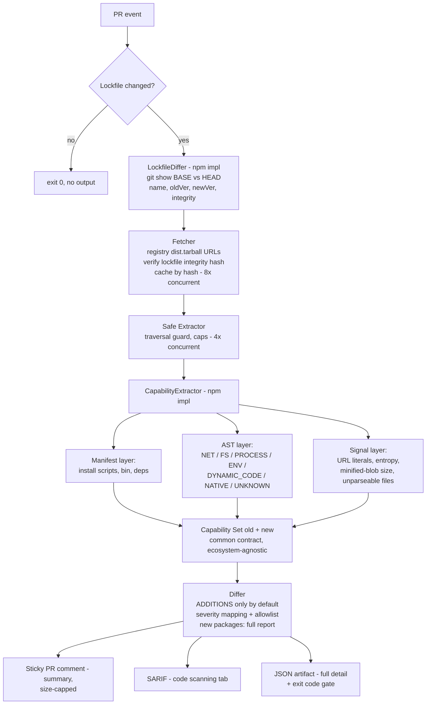

# capdelta — Dependency Behavioral Diff: Dev Plan & Architecture (rev. 3)

Working name: `capdelta` — **verified free on npm (registry 404) and effectively unclaimed on GitHub** (one dormant adjacent research repo) as of 2026-07-14. `depdiff` is taken (same-concept npm package + 15 repos); `capdiff` is an active same-concept cargo tool (telcharr/capdiff, studied as prior art — see §4.4, §8).
Revision 3: rev. 2 review fixes + capdiff prior-art adoptions (shape-based severity, FS_SENSITIVE, evidence format, baseline snapshot to v0.2, --strict, benign-pattern suppression).

## 1. Problem statement

CVE scanners are blind to a trusted package shipping a malicious version (axios 2026, Shai-Hulud 2025): there is no CVE at attack time. The reliable signal is a **capability delta**: version N+1 can do things version N could not (install script appears, network calls appear in a string-utils lib, obfuscated blob grows). `capdelta` answers one question in the PR that bumps a dependency: **"What can the new version do that the old one couldn't?"**

**Core bet and its limits (decided):** delta = review-worthy. A package that was already malicious or already broad-capability shows no delta — accepted blind spot, documented in §3. Exception (decided): **newly added packages get a full capability report** — everything is "new" for them, and a fresh dependency arriving with an install script plus network access deserves a report even without history.

## 2. Scope

### v0.1 (in scope)
- Ecosystem: **npm only**, `package-lock.json` v2/v3. **Design constraint (decided):** `LockfileDiffer` and `CapabilityExtractor` are ecosystem-specific implementations behind a common capability-set contract, so PyPI/Go/etc. later are "add an implementation," not "refactor the core." Recorded as an ADR at M0.
- Trigger: lockfile change in a PR (Dependabot/Renovate or manual bump). **No-op fast path (decided):** PR does not touch the lockfile → exit 0 in milliseconds, no comment, no analysis.
- Analysis: **static only**. The tool never executes package code.
- Packages analyzed (decided): **all packages whose resolved version changed in the lockfile — direct and transitive — with concurrency caps.** Transitive is where laundering attacks hide (§3). Defaults: 8 concurrent fetches, 4 concurrent extractions, ~5 min wall-clock budget for the whole run. If the budget is exceeded: **degrade loudly, never silently** — report "analyzed X of Y changed packages," prioritized by heuristic (packages with install scripts first, then smallest download first, then lockfile order). Newly added packages: full capability report.
- Private-registry packages (decided): **skip and flag** ("N private packages not analyzed"). Registry auth handling deferred.
- Output: sticky PR comment (summary), SARIF, JSON, exit-code gate.

### Explicitly out of scope for v0.1 (roadmap)
- yarn.lock / pnpm-lock.yaml; multiple lockfiles / workspaces (single lockfile path input only).
- Other ecosystems (interface boundary prepared, see above).
- Dynamic (sandbox) analysis.
- Reputation/metadata signals (maintainer change, publish cadence) — candidate for v0.3.
- **Baseline snapshot** (`--baseline`: committed capability-snapshot file; diff against last *reviewed* state, not just N-1 — the slow-roll mitigation, §3) — **v0.2**, promoted from "future" after capdiff (cargo) demonstrated it is cheap: serialize capability sets to a committed file.
- Intra-package dataflow (re-export resolution) — v0.2 (see §4.3).

## 3. Threat model (published in the README; decisions recorded as ADRs)

**Adversary:** attacker with publish rights to a legitimate npm package (account takeover, malicious maintainer, build pipeline compromise). Goal: execute code on developer/CI machines at install time or app runtime.

**What capdelta catches:** capability additions between versions — new install scripts, new network/process/fs/env access, dynamic code evaluation, native/wasm payloads, new external endpoints, obfuscation jumps.

**Known evasions (stated honestly in the README):**
- **No-delta attacks:** capabilities present since v1, or a package malicious from its first version when added long ago. capdelta sees change, not absolute risk.
- **Slow-roll attacks:** capabilities added innocuously across several versions (v1.1 adds NET, v1.3 abuses it). Each diff looks small. Accepted gap in v0.1; mitigated in v0.2 by the committed baseline snapshot (§2 roadmap).
- **Capability laundering via a new dependency:** the bumped package adds no code itself — it adds a dependency that carries the capabilities. Caught, because every changed lockfile entry is analyzed and new packages get full reports. **This is why transitive analysis is non-negotiable** (README: user-facing rationale; ADR-003: decision record with rejected alternatives — direct-only, `--deep` flag).
- Heavy obfuscation defeating AST analysis — partially mitigated by entropy/unparseable-blob signals, which are themselves findings.
- Dynamic `require(variable)` — reported as `UNKNOWN` capability, not resolved.
- Registry response compromise — mitigated: tarballs verified against the lockfile `integrity` hash; capdelta analyzes byte-for-byte what `npm ci` would install.

**The tool is itself an attack surface.**
- It downloads and parses attacker-controlled tarballs: safe extraction (reject path traversal, absolute paths, symlinks escaping the extraction root), size and file-count caps, parse timeouts, zero code execution. Extractor is fuzzed with malformed archives (M4).
- **Output injection (decided):** package names, script contents, and URL literals quoted in reports are attacker-controlled strings rendered into GitHub markdown and SARIF. Escape everything, never render attacker content as links, truncate aggressively. Covered by adversarial reporter tests (§7).
- **Fork PRs (decided):** on public repos, fork PRs run with a read-only token — the sticky comment cannot be posted. Per degrade-loudly: fork PRs fall back to job summary + check status, stated in the README. **Never use `pull_request_target` with a checkout of PR head to work around this** — that is the classic Actions pattern for exposing repo secrets to attacker code. Stated explicitly because capdelta's audience will check for it.

## 4. Architecture

### Component specs

**4.1 LockfileDiffer (npm implementation)**
- Input: base-ref lockfile fetched via the **GitHub contents API** (one file, no git history needed — decided over `fetch-depth: 0`, which is slow, and over shallow-clone `git show`, which fails on the default `actions/checkout` depth-1 merge commit). CLI mode outside Actions falls back to `git show BASE:package-lock.json`. Head lockfile read from the checkout. npm lockfile v2/v3 `packages` map.
- Output: `ChangedPackage[] { name, oldVersion|null, newVersion, oldIntegrity|null, newIntegrity, resolvedUrl }` — the ecosystem-agnostic contract.
- Edge cases (spec'd): npm aliases (`npm:pkg@ver`); same package at multiple versions in different tree positions (each position diffed independently); version unchanged but integrity changed → **HIGH finding on its own**; **version downgrade → INFO finding** (cheap to detect, mildly suspicious); package removed → ignore; git/file/link deps → unanalyzable, INFO; private-registry `resolved` URLs → skip and flag (§2).
- **Lockfile-added case (first run / repo adopting capdelta):** old = null for every package → everything is "new." Switch to **first-run mode**: aggregate summary in the comment (counts per severity, top N findings), full details to the JSON artifact. Never emit hundreds of report sections into one comment.

**4.2 Fetcher**
- Download old and new tarballs; verify SRI (`sha512-...`) from the lockfile **before any parsing**. Hash mismatch = CRITICAL finding, abort that package's analysis.
- Cache keyed by integrity hash (Action-cache-friendly). Caps: max tarball 50 MB default, network timeout, no retry storms. Concurrency per §2.

**4.3 CapabilityExtractor (npm implementation)**
Three layers, cheapest first:

1. **Manifest layer** (package.json): `preinstall`/`install`/`postinstall` scripts (presence + content hash; note: `prepare` runs on install only for git deps — tracked but labeled accordingly), `bin` entries, `dependencies` additions, `engines` changes. This layer alone is the M1 deliverable and catches the install-script attack class.
2. **AST layer**: parse `.js`/`.mjs`/`.cjs` (acorn, per §5). `.ts` source files are rare in published packages; in v0.1 they fall to the signal layer as "unparseable" findings. If FP data shows TS-source packages matter, swap to the TS compiler API (ADR at M2/M3 boundary). Closed taxonomy:
   - `PROCESS` — child_process, command execution
   - `NET` — http/https/net/tls/dgram, fetch, WebSocket
   - `FS_READ` / `FS_WRITE` — fs usage split by operation
   - `FS_SENSITIVE` — fs access with path literals near credential stores (curated list: `.npmrc`, `.env`, `.ssh/`, `.aws/credentials`, `.config/gh/`, keychain paths) — adopted from capdiff; targets what attackers actually steal
   - `ENV` — process.env access
   - `DYNAMIC_CODE` — eval, new Function, vm
   - `NATIVE` — .node binaries, node-gyp, wasm loading
   - `UNKNOWN` — dynamic require/import with non-literal argument
   **Resolution honesty tier (decided):** direct literal imports (incl. `node:` prefix) plus **one level of const-alias propagation**. Everything beyond lands in `UNKNOWN`. No taint tracking in v0.1. **Location context:** every capability record notes whether the evidence sits in install-script code (the script itself, or a file it invokes by literal path) — the shape rules in §4.4 depend on it. Roadmap: v0.2 adds intra-package re-export resolution (tractable, cf. Semgrep/CodeQL); full JS dataflow is statically unsolved in general and permanently out of scope — `UNKNOWN` plus the signal layer are the backstop.
3. **Signal layer** (works on minified code): URL/IP literal extraction (diff the domain set), Shannon entropy per file (flag jumps), total minified/unparseable bytes (flag growth), hex/charcode array patterns.

Every unparseable file is a datum: "N files could not be parsed (+X KB vs previous version)" is a finding, never a silent skip.

**4.4 Differ & severity model**
Report **additions only** by default (`--full-inventory` opt-in); newly added packages get full reports.

**Shape rules first (adopted from capdiff, the cargo prior art): severity comes from capability *combinations* and *context*, not single capabilities.** Evaluated against the gained set (full set for new packages):

| Shape | Severity | Rationale |
|---|---|---|
| Any of `NET` / `PROCESS` / `ENV` / `FS_SENSITIVE` **located in install-script code** | CRITICAL | Install scripts run at install time with full permissions (npm's build.rs) |
| `NET` + (`ENV` or `FS_SENSITIVE`) in the same package | CRITICAL | Exfiltration shape: read secrets + send them |
| Obfuscation signal + (`PROCESS` or `DYNAMIC_CODE`) | CRITICAL | Smuggled-loader shape: hidden payload + execution primitive |
| Install script added or content changed | CRITICAL | The attack vector itself |
| `DYNAMIC_CODE` or `NATIVE` added | CRITICAL | |

**Per-capability fallback** for gains that match no shape:

| Finding | Severity |
|---|---|
| `NET`, `PROCESS`, or `FS_SENSITIVE` added | HIGH |
| New external domain in literals | HIGH |
| Integrity changed, version identical | HIGH |
| `ENV` or `FS_WRITE` added | MEDIUM |
| Entropy jump / unparseable-blob growth | MEDIUM |
| `FS_READ`, `UNKNOWN` require | LOW |
| New dependency added | LOW, **cross-linked** to that dependency's own full report ("lodash-util added dep `evil-pkg` → see evil-pkg report") — coverage lives in the linked report, not the severity |

**Evidence (adopted from capdiff):** every finding carries `file:line` + a short snippet (e.g., `require('child_process') at lib/util.js:14`). A finding without evidence is an assertion. Snippets are attacker-controlled — escaped and truncated per §3 output injection.

Severity mapping is provisional (judgment plus capdiff's field-tested shapes) until the corpus validation in §7.4 corrects it.

Allowlist config (`.capdelta.yml`): suppress `(package, capability)` pairs with a required justification; suppressions appear in the report as "suppressed (reason)" — they never disappear.

**4.5 Reporter**
- Sticky PR comment, updated in place. **Size-capped:** summary table only in the comment (GitHub truncates ~65k chars); full details go to the JSON workflow artifact and SARIF. A 200-package framework bump must not produce a 200-section comment. **First-run mode** (lockfile added, §4.1) uses the aggregate summary. **Fork PRs** (read-only token, §3): degrade to job summary + check status.
- SARIF 2.1.0 → GitHub code-scanning tab.
- All attacker-controlled strings escaped/truncated; never rendered as links (§3 output injection).
- Framing rule in all copy: **"review this change,"** never "malware detected."
- Exit code: fail only at/above configurable threshold (default: CRITICAL fails; everything else comments). **`--strict` (adopted from capdiff):** exit 2 if any file could not be parsed or any package could not be analyzed — the CI-grade form of degrade-loudly for teams that want unanalyzed = failed.

**4.6 Action packaging**
- node20 JavaScript Action. Inputs: `lockfile-path`, `fail-on`, `config-path`, `base-ref`.
- **Minimal token permissions, documented verbatim in the README:** `pull-requests: write` (comment), `contents: read`, and — only from M3 when SARIF ships — `security-events: write`. Nothing else requested, and nothing requested before it's used.
- Also a plain CLI (`npx capdelta --base main`) — CI-agnostic.

## 5. Language decision (DECIDED: TypeScript)

Rationale (recorded as ADR-001): the core component is a JavaScript parser pipeline; TS gives battle-tested parsing (acorn or TS compiler API) of everything npm packages actually contain, native Action packaging, one ecosystem for tool/tests/fixtures. Go was rejected for this project because its JS-parsing story (cgo/tree-sitter or embedded engine) concentrates effort exactly in the hardest component; deciding factor: **finished beats impressive**. Go fluency is pursued separately via a Stage-1 contribution (e.g., a TruffleHog detector).

**Parser choice within TS:** prefer **acorn** (+ acorn-walk) over the full TS compiler API unless TS-source parsing proves necessary — smaller dependency footprint (see §10 dependency budget) and faster. Record the final pick as an ADR at M2/M3 boundary.

## 6. Milestones (walking skeleton; no time estimates; every milestone shippable)

- **M0 — Scaffolding & decisions.** Repo, strict TS config, ESLint, vitest, CI green on the tool's own PRs. `docs/adr/` started: ADR-001 language, ADR-002 static-only, ADR-003 transitive-all, ADR-004 ecosystem interface boundary. **License decided and committed: Apache-2.0** (patent grant; matches OSV-Scanner/vet norms; corporate-adoption-friendly). Name collision check (npm + GitHub).
- **M1 — Manifest-only CLI.** LockfileDiffer + Fetcher (**integrity verification and safe extraction land here — day-one security requirements, not hardening**) + manifest layer + JSON/text report + no-op fast path. **Golden-test fixtures start here** (manifest-layer pairs). Detects the install-script attack class end-to-end.
- **M2 — Action packaging & reporting core.** Sticky size-capped PR comment, exit-code gate, marketplace-ready action.yml with minimal permissions. **Adversarial reporter tests land here** (the comment renders attacker-controlled strings from this milestone on — the injection control ships with its test). **Dogfooding starts: capdelta watches capdelta's own lockfile from this point on.** **Share publicly at M2** (tl;dr sec, Detection Engineering Weekly, r/netsec): a scoped working install-script detector earns feedback that reshapes M3–M4 better than solo guessing. Announceable as v0.1.
- **M3 — AST layer.** Taxonomy, resolution honesty tier, severity model, SARIF output, new-package full reports, new-dep cross-linking. **Immediately after M3: informal FP corpus check** — ~20 popular packages × recent legit bumps — before building the signal layer on possibly-wrong severity assumptions.
- **M4 — Signals & hardening.** Entropy/blob/URL-diff signals, allowlist config, concurrency caps + wall-clock budget + loud degradation, extractor fuzzing with malformed archives. **Benign-pattern suppression** (capdiff's noise-suppression idea, npm translation): curated recognizer for routine install scripts (`node-gyp rebuild`, `husky install`, `patch-package`) so they rank below `curl | bash` — driven by the post-M3 FP data, not guessed upfront.
- **M5 — Validation & publication.** Formal corpus measurement (§7.4), README with threat model + evasions + measured numbers, real-PR screenshot demo, blog writeup.

## 7. Testing strategy

1. **Unit:** extractor vs handcrafted fixtures — one minimal sample per capability class, plus adversarial samples (`const cp = require('child'+'_process')` → must land in `UNKNOWN` at minimum).
2. **Golden/integration:** committed mini-tarball pairs (benign v1 → capability-added v2); assert exact report output. One golden pair per severity row of §4.4. Starts at M1 with manifest-layer pairs; grows with each milestone.
3. **Adversarial reporter tests:** package names / script contents / URLs containing markdown+HTML injection payloads must render inert in the PR comment and SARIF. A control without a test doesn't exist.
4. **Corpus validation (the differentiator):**
   - **True-positive set:** historical malicious version pairs from the OpenSSF `malicious-packages` dataset and documented incidents where artifacts are retrievable. **Handling rule (decided): live malware is never committed to the main repo** — fetch at test time in CI, or keep a separate, clearly labeled defanged-samples repo. Prevents GitHub flagging and accidental execution by anyone cloning. **Fallback (npm unpublishes malware):** reconstruct attacks as synthetic pairs modeled on documented incidents (event-stream injection pattern, Shai-Hulud postinstall pattern), explicitly labeled as reconstructions in the README. Measured-against-reconstructions beats unmeasured.
   - **False-positive set:** last ~50 legitimate bumps across ~20 popular packages. Informal run after M3; formal published numbers at M5.
5. **E2E:** Verdaccio local registry in CI; publish v1/v2 dummy packages; real lockfile-bump PR scenario; assert Action output. Doubles as the demo.

## 8. Risk register

| Risk | Mitigation |
|---|---|
| FP noise → tool gets disabled | Additions-only default, CRITICAL-only gate default, allowlist with justifications, "review" framing, FP check pulled forward to post-M3 |
| Scope creep in extractor | M1 manifest-only; closed taxonomy; new capability classes require an ADR |
| Malicious tarball attacks the tool | Safe-extraction rules from M1, caps, static-only, fuzzing at M4 |
| Report output injection | Escape/truncate all attacker strings; adversarial reporter tests |
| Minified packages defeat AST | Signal layer treats unparseable bytes as first-class findings |
| Slow-roll attacks | Accepted v0.1 gap, named in threat model; future diff-against-last-reviewed |
| Private registries | Skip-and-flag (decided); auth handling deferred |
| Big transitive bumps blow the CI budget | Concurrency caps + wall-clock budget + loud partial-analysis reporting |
| Project abandonment | Walking-skeleton order: everything past M2 improves a live, finished tool |
| Overlap with Socket/commercial and capdiff (cargo) | Positioning: capability-diff exists for cargo (capdiff, **credited as prior art** — severity shapes adopted from it); capdelta brings it to npm — the ecosystem with >99% of open-source malware — as a PR-native Action (sticky comment, Dependabot integration, fork-PR handling, first-run mode) with **measured** FP/TP rates, which no incumbent publishes. Open, CI-native, no SaaS. Stated in README |
| Name collision | Check npm + GitHub at M0 |

## 9. Definition of done for "portfolio-ready"

README contains: 30-second pitch, threat model incl. known evasions, measured TP/FP numbers (reconstructions labeled), architecture diagram, ADR index, minimal-permissions block, dependency-budget statement. **Dogfooding evidence:** capdelta has watched its own lockfile since M2, and at least one real Dependabot PR in the repo shows a capdelta comment — that screenshot is the demo asset (a real PR beats a staged GIF). The repo's own CI is green.

## 10. Project-level requirements (the tool must pass its own standards)

- **Dependency budget:** target **<10 runtime dependencies** (motivates acorn over the TS compiler API). A dependency-security tool with 300 transitive deps is self-refuting, and reviewers will check. README line: "capdelta passes capdelta."
- **Own supply chain:** pinned lockfile, npm provenance attestations on release, releases from CI only.
- **Consumption guidance:** README instructs users to pin the Action by commit SHA, not tag; and, if Renovate/Dependabot **auto-merge** is enabled, to make capdelta a **required status check** — otherwise bumps merge before anyone reads the comment.
- **Least privilege:** exact minimal `permissions:` block documented; nothing beyond §4.6 requested.
- **License:** Apache-2.0 (ADR at M0).
